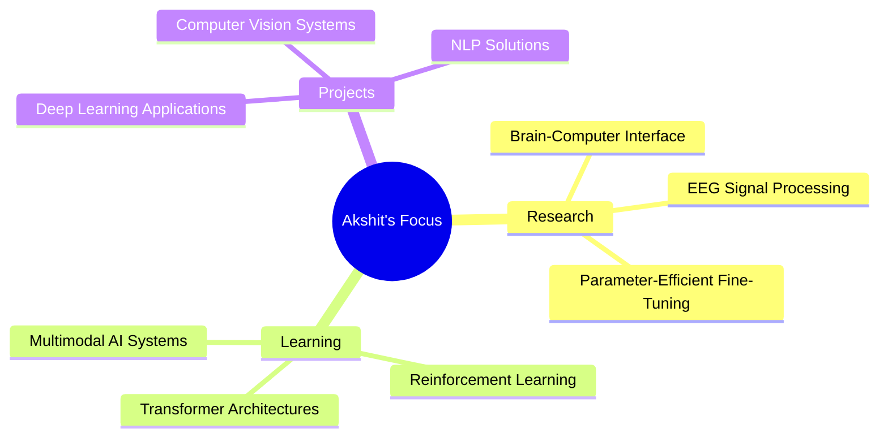
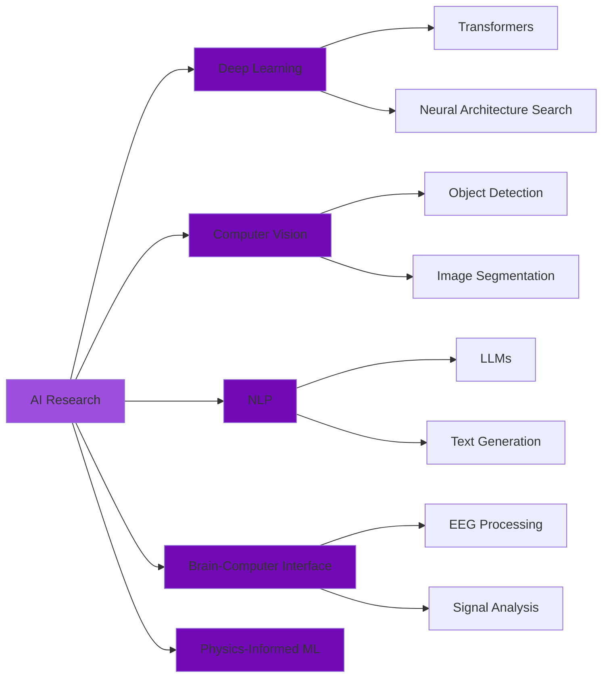

<div align="center">

# 👋 Hi, I'm Akshit Manocha


[](https://www.linkedin.com/in/akshit-manocha/)
[](mailto:akshitmanocha37@gmail.com)
[](https://github.com/akshitmanocha)
[](https://www.kaggle.com/akshitmanocha)

</div>

---

## 🚀 About Me


```python
class AkshitManocha:
    def __init__(self):
        self.name = "Akshit Manocha"
        self.role = "ML & AI Researcher"
        self.education = {
            "institute": "IIT Roorkee",
            "major": "Chemical Engineering",
            "year": "Pre-Final Year",
            "cgpa": 8.30
        }
        self.research_areas = [
            "Deep Learning",
            "Computer Vision", 
            "Natural Language Processing",
            "Brain-Computer Interface",
            "Physics-Informed ML"
        ]
        self.currently_learning = [
            "Transformer Architectures",
            "Reinforcement Learning",
            "Multimodal AI"
        ]
    
    def say_hi(self):
        print("Thanks for dropping by! Let's build something amazing together!")

me = AkshitManocha()
me.say_hi()
```

<br clear="right"/>

---

## 🎯 What I Do

- 🧠 **Deep Learning Research**: Pushing boundaries in neural network architectures
- 🔬 **Brain-Computer Interfaces**: Working on cutting-edge EEG signal processing
- 👁️ **Computer Vision**: Developing intelligent visual systems
- 📊 **ML Engineering**: Building scalable and efficient ML pipelines
- 🤝 **Open to Collaborate**: Always excited about innovative AI projects!

---

## 🔬 Research Experience

### 🧪 Research Intern @ PARIMAL Lab
**Focus**: Brain-Computer Interface & EEG Signal Processing

- 🎯 Implemented state-of-the-art EEG processing models for BCI applications
- 🏆 **Achieved 97.5% accuracy** using advanced parameter-efficient fine-tuning techniques
- 📊 Developed robust preprocessing pipeline for diverse EEG datasets
- 🔧 Optimized model performance through innovative architectural improvements

---

## 🏆 Achievements & Highlights

<div align="center">

### 🥈 Silver Medal - FIDE & Google Efficient Chess AI Challenge

**Ranked 46th out of 1,120 teams** on Kaggle

[](https://www.kaggle.com/competitions/fide-google-efficiency-chess-ai-challenge)

</div>

### 📜 Certifications & Coursework

| Course | Institution | Focus Area |
|--------|-------------|------------|
| **CS229: Machine Learning** | Stanford University | ML Fundamentals & Applications |
| **CS224N: NLP with Deep Learning** | Stanford University | Natural Language Processing |
| **6.S191: Intro to Deep Learning** | MIT | Deep Learning Foundations |

---

## 💻 Technical Arsenal

<div align="center">

### 🔤 Languages


### 🧠 ML/DL Frameworks


### 📊 Data Science & Analytics


### 🛠️ Tools & Platforms


</div>

---

## 📊 GitHub Analytics

<div align="center">
  


</div>

---

## 🎯 Current Focus



---

## 🌟 Featured Projects

<div align="center">

| Project | Description | Tech Stack | Highlight |
|---------|-------------|------------|-----------|
| **🧠 EEG-BCI System** | Advanced brain-computer interface using deep learning | PyTorch, Signal Processing | **97.5% Accuracy** |
| **♟️ Efficient Chess AI** | Optimized chess engine for FIDE-Google challenge | Reinforcement Learning, Optimization | **Top 5% Globally** |
| **🔮 Coming Soon...** | Stay tuned for more exciting projects! | - | - |

</div>

---

## 📈 Contribution Graph

<div align="center">
  


</div>

---

## 💡 Research Interests

<div align="center">



</div>

---

## 🤝 Let's Connect!

<div align="center">

### 💬 Open to Collaborations & Research Opportunities

I'm always excited to work on innovative ML/AI projects and discuss cutting-edge research. Feel free to reach out!

[](https://www.linkedin.com/in/akshit-manocha/)
[](mailto:akshitmanocha37@gmail.com)

### 📊 Profile Views


---


</div>

---

### ⚡ Fun Fact

> "The only way to do great work is to love what you do" - Steve Jobs

**Currently exploring**: How AI can revolutionize our understanding of the human brain! 🧠✨
