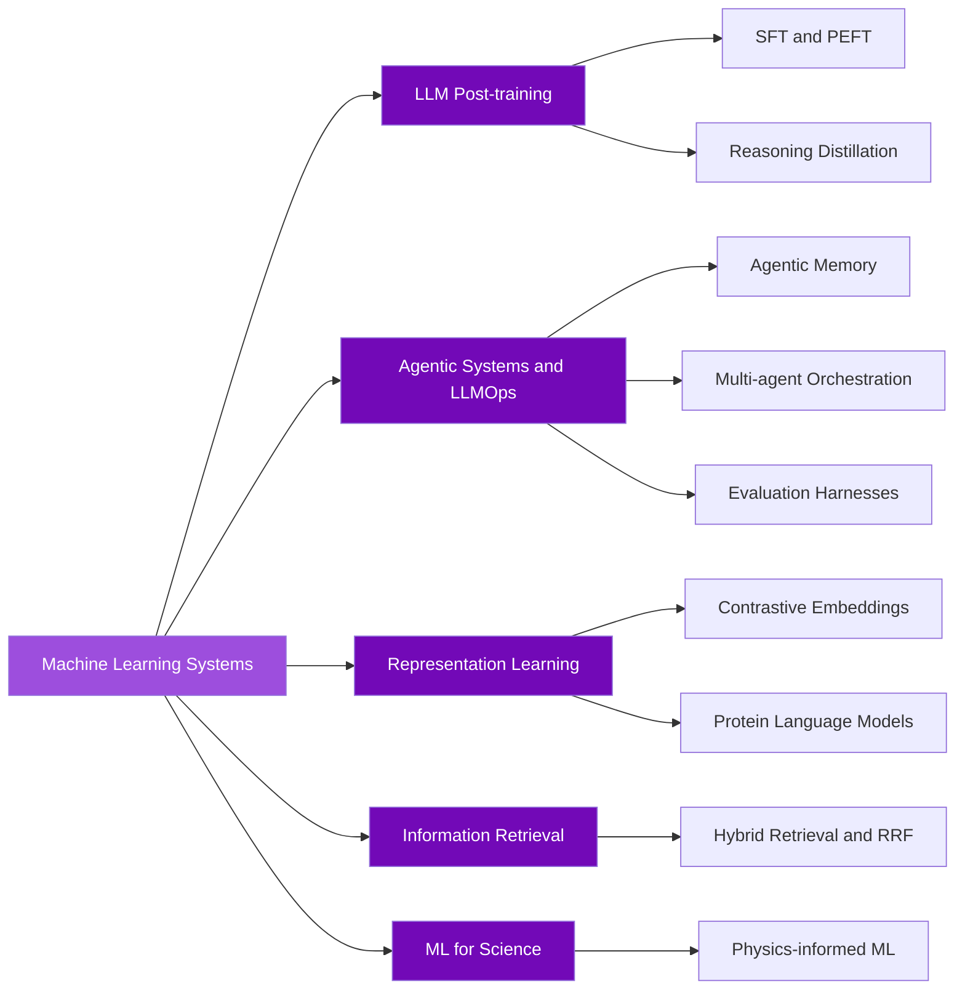

 

 

## Research Focus

Final-year B.Tech student at **IIT Roorkee** and **Applied Scientist Intern at Amazon**, working on machine learning systems that are measured, reproducible, and production-shaped. My work spans **LLM post-training and reasoning**, **agentic systems and LLMOps**, and **representation learning** for both language and scientific data.

I care about the full loop — from a research idea to a rigorous evaluation harness to a containerized, deployable service — and I default to *measuring* claims rather than asserting them.

**Interests**
- LLM reasoning &nbsp;·&nbsp; post-training (SFT, PEFT, distillation)
- Agentic memory &nbsp;·&nbsp; multi-agent orchestration &nbsp;·&nbsp; LLMOps / evaluation
- Representation & contrastive learning
- Information retrieval &nbsp;·&nbsp; ML for scientific discovery

 

## Experience

### Applied Scientist Intern — Amazon
`May 2026 – Aug 2026 · Bangalore` &nbsp;|&nbsp; *Representation learning · geospatial ML · uncertainty*

- Trained a **contrastive location embedding** (CLIP-style InfoNCE with a frozen geo-encoder warm-start and time-conditioned fusion) that distills operational behavior into a coordinates-plus-time "fingerprint," so delivery-time predictions generalize to **cold-start zones with no history**.
- Engineered a reusable feature pipeline over **49M+ orders** — traffic-friction speed, order density, and dwell time from delivery GPS — aggregated per zone × hour × day-of-week at multiple spatial scales.
- Built a rigorous **spatial cold-start protocol** (whole-zone / whole-city holdout, leakage-controlled ablations) to isolate generalization from memorization on a conformal delivery-window model at **90% coverage**.

## Selected Projects

### LLM Post-training & Reasoning

**NVIDIA Nemotron Reasoning Challenge** — *teaching a 30B model to reason*
Fine-tuned a **30B-parameter Nemotron** model to solve logic puzzles via supervised fine-tuning with **Unsloth**. Built an LLM pipeline that classifies every puzzle type and extracts its hidden rule, then used a larger teacher (**GPT-OSS-120B**, served with **vLLM**) to generate step-by-step reasoning and **distilled** it into the smaller model.
`SFT · PEFT/LoRA · distillation · Unsloth · vLLM`

### Agentic Systems & LLMOps

**MemEval — does agentic-memory complexity earn its cost?**
A controlled, reproducible study comparing **six LLM-agent memory strategies** (no-memory, full-context, BM25, FAISS, **Mem0**, **A-MEM**) on the **LongMemEval** benchmark under one pinned reader, scorer, and budget — measuring **accuracy *and* cost** (ingest time, query tokens, latency, store size). Crash-resilient per-system subprocess driver, bootstrap CIs, and paired-difference significance testing.
`agentic memory · evaluation · Ollama · bootstrap stats · reproducibility`

**Smart Provider Credentialing Analytics Platform** — [repo](https://github.com/akshitmanocha/Smart-Provider-Credentialing-Analytics-Platform)
A **multi-agent** system (hand-rolled supervisor: understand → plan → dispatch → synthesize) that reconciles a healthcare provider roster against authoritative sources and answers plain-English questions. The governing rule — **the LLM never computes a number** — with a deterministic numeric-**faithfulness guard**, a 3-mode backend (hosted Groq → local Ollama → deterministic fallback), and a **4-suite LLMOps evaluation scorecard** gated for CI.
`multi-agent · LLMOps · faithfulness · DuckDB · Flask · Docker`

### Representation Learning & Information Retrieval

**CAFA-6 Protein Function Prediction** — *Kaggle Global Rank 19 (Competitions Expert)*
Placed **19th of thousands** worldwide (team). Built a **multi-tower** model fusing pretrained protein language models (**ESM-2, ProtT5**) with taxonomy for 3,000-way hierarchical multi-label GO-term prediction, plus a **BLAST nearest-neighbor** transfer model — ontology-aware label propagation (True Path Rule) and IA-weighted F-max threshold selection throughout.
`ESM-2 · ProtT5 · multi-label · hierarchical classification · transfer learning`

**Beetle — hybrid semantic search engine** — [repo](https://github.com/akshitmanocha/Beetle-Search-Engine)
End-to-end retrieval system over AI/ML content: crawling, extraction, weakly-supervised quality classification, and **lexical (BM25) + dense (FAISS) + learned-sparse (SPLADE) + ColBERT** indexes fused with weighted Reciprocal Rank Fusion and a cross-encoder reranker. Improved **NDCG@10 to 0.77 from a 0.65 keyword baseline** on BEIR; shipped as a containerized **FastAPI** service with health probes, property tests, and a **DVC** pipeline.
`hybrid retrieval · SPLADE · ColBERT · RRF · FastAPI · DVC · BEIR eval`

### ML for Scientific Discovery

**Epidemic-PINN — recovering hidden transmission rates from case data**
Recovers an epidemic's time-varying transmission rate β(t) and reproduction number R(t) from reported cases alone, by backpropagating **through a differentiable SEIR simulator** (torch RK4). On Germany's first wave it tracks an independent OWID estimate to **RMSE 0.14** and beats a classical growth-rate baseline by **~10×**, with identifiability treated honestly throughout.
`physics-informed ML · differentiable simulation · inverse problems · PyTorch`

## Technical Skills

**Languages**

**ML / Deep Learning**

**LLM / Gen AI / Agentic**

**MLOps / LLMOps / Infra**

## Achievements

| Year | Achievement |
|---|---|
| 2026 | **Global Rank 19**, Kaggle CAFA-6 Protein Function Prediction |
| 2026 | **Competitions Expert**, Kaggle |
| 2025 | **AIR 26**, Amazon ML Challenge |
| 2024 | **Global Rank 46 / 1,120**, FIDE & Google Efficient Chess AI Challenge (Silver) |
| 2023 | **AIR 4441**, JEE Advanced |

## Education

**B.Tech, Chemical Engineering** — Indian Institute of Technology (IIT) Roorkee
Expected July 2027 · CGPA **8.39 / 10**

**Selected self-study:** CS229 (Machine Learning, Stanford) · CS224N (NLP with Deep Learning, Stanford) · MIT 6.S191 (Deep Learning)

## Research Map

```mermaid
graph LR
    A[Machine Learning Systems] --> B[LLM Post-training]
    A --> C[Agentic Systems and LLMOps]
    A --> D[Representation Learning]
    A --> E[Information Retrieval]
    A --> F[ML for Science]
    B --> B1[SFT and PEFT]
    B --> B2[Reasoning Distillation]
    C --> C1[Agentic Memory]
    C --> C2[Multi-agent Orchestration]
    C --> C3[Evaluation Harnesses]
    D --> D1[Contrastive Embeddings]
    D --> D2[Protein Language Models]
    E --> E1[Hybrid Retrieval and RRF]
    F --> F1[Physics-informed ML]
    style A fill:#9D4EDD,color:#fff
    style B fill:#7209B7,color:#fff
    style C fill:#7209B7,color:#fff
    style D fill:#7209B7,color:#fff
    style E fill:#7209B7,color:#fff
    style F fill:#7209B7,color:#fff
```

## GitHub Activity

## Contact

Open to research, MLOps / LLMOps, agentic, and Gen AI roles and collaborations.

